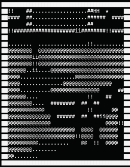

# COMP-1510-202330-Term-Project

Every program needs a README.md

This is written in markdown. Read about markdown here: [markdowncheatsheet](https://www.markdownguide.org/cheat-sheet/)

## Your name:

Tatsuya Yoshida

## Your student number:

A01361712

## Your GitHub username:

yoshidont-mind

## Any important comments you'd like to make about your work:

For commits prior to 'COPY code from pokemon-in-vancouver!', please refer to the other repository (pokemon-in-vancouver).
https://github.com/yoshidont-mind/pokemon-in-vancouver

## About this game

### __0. Overview：__
I grew up with Pokémon. I still remember, as if it were yesterday,
how excited I was when I got my first Pokémon game for Christmas when I was six years old.

Driven by the thought, "How it would be fun if there were Pokémon in Vancouver!" I created this game. Once the game 
starts, please enter "5" to open the map and take a look.

The top-left of the map corresponds to Cypress Mountain, bottom-left to UBC, bottom-right to Mount Pleasant, and 
top-right to Deep Cove. The symbols on the map have the following meanings:
- "#": Obstacle (impassable)
- "@": Sea (impassable)
- ".": Bush (wild Pokémon randomly appear)
- " ": Road (items are sometimes found)
- "i": Information board
- "!": Events occur
- "H": Home (Pokémon get healed)

Doesn't it somewhat resemble a map of the Vancouver area?

The player starts from their home in North Vancouver, catches and raises Pokémon, and goes through some events, 
aiming for the BCIT Pokémon Gym. Your goal is to defeat the Gym Leader, to earn the Gym Badge.     

### __1. How the Game Progresses:__
At the beginning of each iteration, the map around the character is displayed, and the player chooses an action.      

#### __1-1. Players' options：__
- 1 ~ 4: Move up, down, left, or right
- 5: Open map 
  - You can see the entire game map.
- 6: Check status 
  - You can check your Trainer rank, Next goal, list of items, and list of Pokémon.
- 7: Heal Pokémon 
  - Select one Pokémon from your list and use a Potion to fully restore its HP.
- 8: Change Pokémon order 
  - Select one Pokémon from your list to swap with the one at the top of the list.
- 9: Escape Pokémon 
  - Select one Pokémon from your list to release it.
- 0: Save game and quit 
  - Save your data and exit the game.

#### __1-2. Event Occurrence:__
When character moves, events corresponding to the new location occur.     
#### __1-3. When events end:__
Once an event ends, the map around the character is displayed again, and the player chooses an action.     
#### __1-4. To complete the game:__
While the character aims for the BCIT Pokémon Gym and clear events, the trainer rank increases and the Next goal 
changes accordingly. Finally, when you defeat the Gym Leader and get the Gym Badge, the Trainer rank reaches 3, 
and the game gracefully ends.     
However, you know what? the Trainer rank actually can be up to 4, and you can revoke the game to enjoy the rest of the 
story!
Of course, if you are interested. (Please say yes..!)     

### __2. Some other things to note:__
#### __2-1. Battle with wild Pokémon__
When the character enters a bush, a wild Pokémon randomly appears and a battle starts. The character can choose from 
the following actions each turn:
- 1: Attack 
  - Your Pokémon and then the wild Pokémon attack in turn. 
  - Damage is calculated based on each one's attack and defense, and HP is reduced accordingly.
- 2: See Pokémon 
  - Check the remaining HP of all your Pokémon.
- 3: Catch Pokémon 
  - You can throw a Poké Ball to catch the wild Pokémon.
  - The more weakened the wild Pokémon has been, the higher the chance of capturing it.
  - If the capture fails, the opponent Pokémon attacks yours.
- 4: Run 
  - The stronger the opponent Pokémon, the lower the chance of escaping. 
  - If you fail to escape, the opponent Pokémon attacks yours.    
  
The battle ends when you defeat or capture the wild Pokémon, or successfully run away.      

#### __2-2. Battle with Pokémon trainer__
At some places with "!", you might battle Pokémon trainers. Trainers will send out several Pokémon in 
succession. Defeating all of them ends the battle.     

#### __2-3. What happens when you lose a battle__
If all your Pokémon are defeated in battle, the battle ends. In this case, you are returned to your home and lose 
all your Potions and Poké Balls.     

#### __2-4. What happens when your trainer rank goes up?__
As well as you gain access to new areas, the variety of Pokémon you encounter in bush expands!   (Initially you can 
see only four different species, but eventually, there will be 8, 12, and ultimately 16 different Pokémon appears!) 
   

That's all for now. I hope you enjoy the game!

## Indices for mandatory elements
| No.   | Element                                                                            | Where you can find it                                                                                                                                                                                                               |
|-------|------------------------------------------------------------------------------------|-------------------------------------------------------------------------------------------------------------------------------------------------------------------------------------------------------------------------------------|
| 1     | main function in game.py                                                           | game.py: line 530-534                                                                                                                                                                                                               |
| 2     | game.pdf                                                                           | /pdfs/game.pdf                                                                                                                                                                                                                      |
| 3 (a) | whimsical, descriptive, and engaging scenario                                      | game.py: line 409-420, 515-525  (game())   event.py: line 63-100, 175-217, 336-369, 450-471, etc.                                                                                                                            |
| 3 (b) | environment with 5 × 5 or more grids                                               | game.py: line 36 (generate_map_dictionary())                                                                                                                                                                                        |
| 3 (c) | a character who has a name, level, HP, and other meaningful attributes             | game.py: line 405-408 (game())   battle.py: line 688-747 (generate_pokemon())                                                                                                                                                    |
| 3 (d) | character movement in the four cardinal directions                                 | game.py: line 158 (get_user_choice())                                                                                                                                                                                               |
| 3 (e) | obstacle when character moves                                                      | game.py: line 432-446   line 557-578 (event.path()), etc.                                                                                                                                                                        |
| 3 (f) | given opportunity to overcome (battle, riddle, etc.)                               | event.py: line 501-538 (event.bush())                                                                                                                                                                                               |
| 3 (g) | the game ends when the character achieves a final goal                             | game.py: line 515-525 (game())                                                                                                                                                                                                      |
| 4 (a) | character start at level one, and be able to reach level three                     | event.py: line 96, 212, 364, 465                                                                                                                                                                                                    |
| 4 (b) | each level needs name and certain amount of experience to reach                    | event.py: line 153-221 (lion_gate_bridge()), 315-373 (bcit_pokemon_gym())   - Character need to win battles to reach the next level.                                                                                             |
| 4 (c) | when character reaches next level, some attributes increase and something improves | event.py: line 215, 367, 468, 516   - When character reaches next level, the variety of Pokémon appearing in bush increases.   battle.py: line 338-437, 750-810   - When Pokémon reaches next level, its status increases. |
| 4 (d) | when character reached level three, they should be able to take on the boss        | game.py: line 517-524, event.py: line 269-288, 433-472   - When character reaches level three, they can challenge the strongest Pokémon trainer.                                                                                 |
| 5     | a coherent, rich ecosystem of challenges                                           | event.py: line 517   - maximum level of wild Pokémon increases as the level of character's Pokémon increases.                                                                                                                    |
| 6     | If a character runs out of mojo, the game must end                                 | event.py: line 221, 373, 473, 537   - If all Pokémon are defeated in battle, character returns home and loses all Potions and Poké Balls.                                                                                        |
| 7 (a) | immutable data structure                                                           | game.py: line 36-89 (generate_map_dictionary()) etc.                                                                                                                                                                                |
| 7 (b) | mutable data structure                                                             | game.py: line 405-408 (game() > character)   battle.py: line 688-747 (generate_pokemon()) etc.                                                                                                                                   |
| 7 (c) | exception handling                                                                 | game.py: line 14-33 (load_save_data())                                                                                                                                                                                              |
| 7 (d) | minimized scope                                                                    | game.py: line 429 (user_choice), 466 (selected_pokemon), etc.                                                                                                                                                                       |
| 7 (e) | small, atomic, and reusable functions                                              | battle.py: line 262-301 (attacks()), 627-685 (append_pokemon()), 771-789 (calculate_attack()), etc.                                                                                                                                 |
| 7 (f) | simple flat code                                                                   | for everything                                                                                                                                                                                                                      |
| 7 (g) | list/dictionary comprehension                                                      | game.py: line 318, 367                                                                                                                                                                                                              |
| 7 (h) | selection using if-statements                                                      | battle.py: line 91-117 (pokemon_battle()), etc.                                                                                                                                                                                     |
| 7 (i) | repetition using for-loops                                                         | battle.py: line 64-88 (next_pokemon()), etc.                                                                                                                                                                                        |
| 7 (j) | membership operators                                                               | event.py: line 282, 389, 408, 427, etc.                                                                                                                                                                                             |
| 7 (k) | range function                                                                     | game.py: line 86, 492, 621, etc.                                                                                                                                                                                                    |
| 7 (l) | one or more functions from itertools                                               | game.py: line 296, 318, 367, etc.                                                                                                                                                                                                   |
| 7 (m) | random module                                                                      | event.py: line 516-517, 550, 570   battle.py: line 555, 598                                                                                                                                                                      |
| 7 (n) | function annotations                                                               | for every function                                                                                                                                                                                                                  |
| 7 (o) | doctests and unit tests                                                            | for every function / unit tests are under the unittests folder                                                                                                                                                                      |
| 7 (p) | f-strings, str.format, or %-formatting                                             | for most of print() (e.g. event.py: line 63-66)                                                                                                                                                                                     |
| 8     | GUI                                                                                | not implemented                                                                                                                                                                                                                     |
